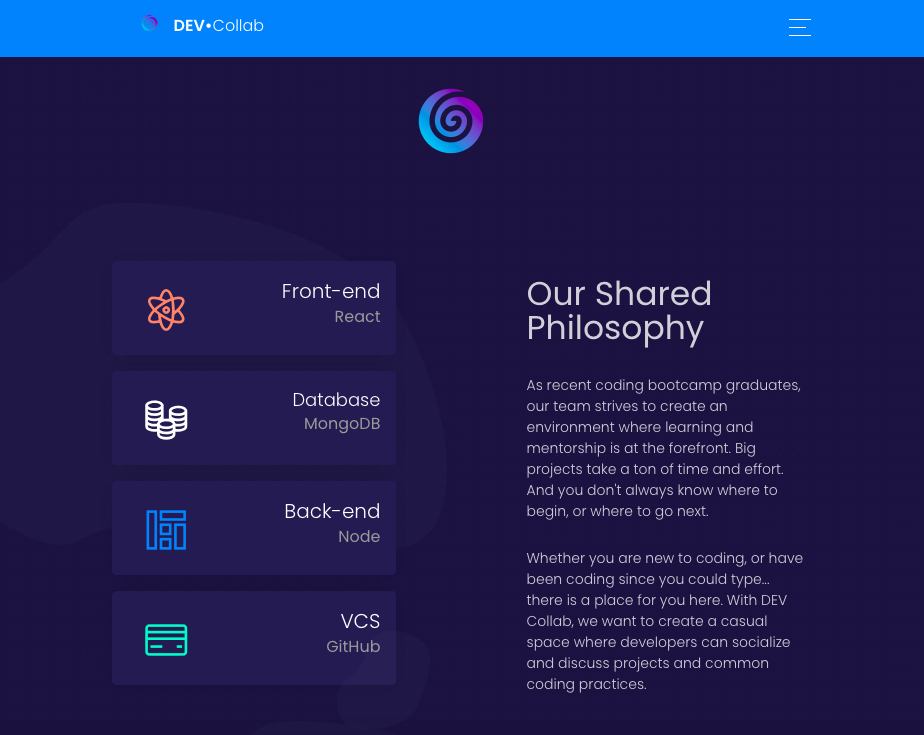
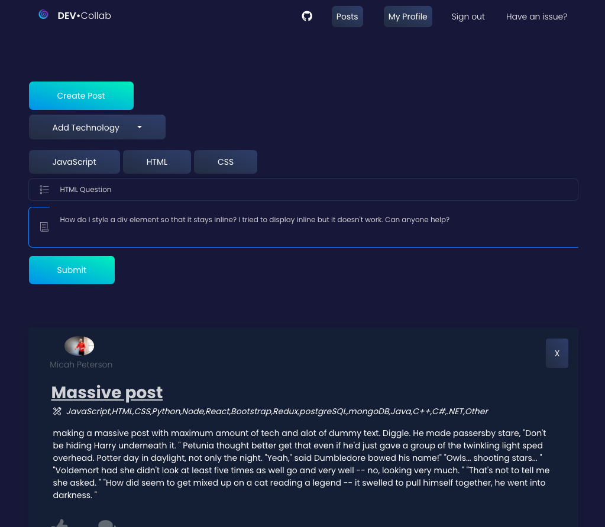
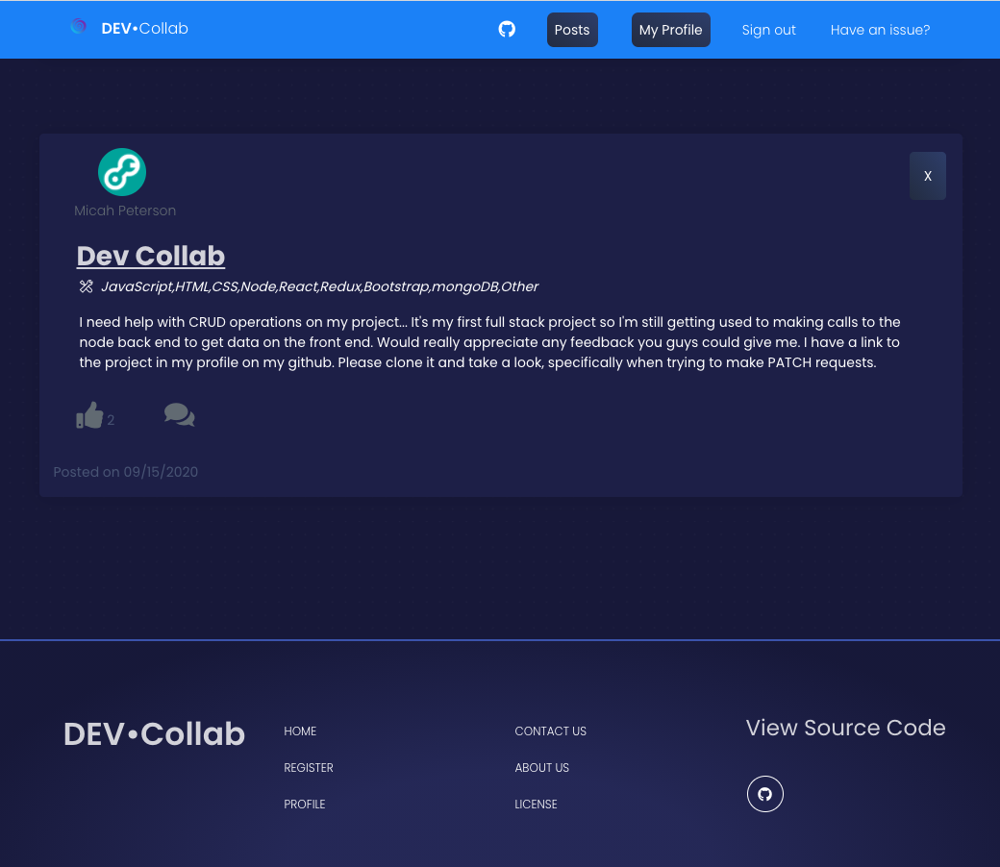
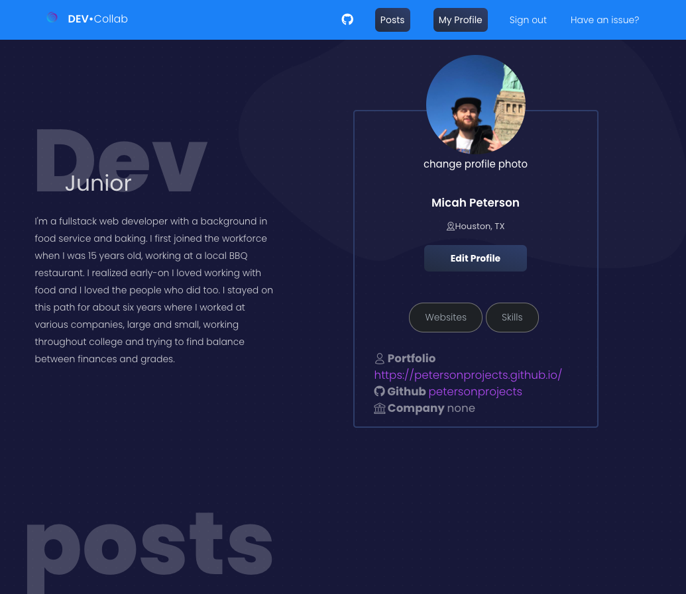

<h1>Dev Collab<h1>




<h2><u>Overview:</u><h2>

<h4>Dev collab is a networking tool for developers to connect with others, talk about their projects and collaborate all in one convenient place.</h4>

</br>

<h2><u>The Team:</u></h2>

<h3>Cainan Barboza</h3>
<a href="https://github.com/CainanB">Cainan's Github</a>
</br>
<b>Role:</b> Back-end Development
</br>

<h3>Micah Peterson</h3>
<a href="https://github.com/petersonprojects">Micah's Github</a>
</br>
<b>Role:</b> Front-End Development
</br>

</br>
</br>
</br>

<h2><u>Tools used in the project:</u></h3>
<h3>Languages:</h3>
<ul>
    <li>HTML</li>
    <li>CSS</li>
    <li>JavaScript</li>
</ul>

Other Tools:

<ul>
    <li>React</li>
    <li>Redux</li>
    <li>React-Bootstrap</li>
    <li>JSON Web Tokens (authentication)</li>
    <li>mongoDB (database)</li>
</ul>

</br>

<h3><u>Base Objectives:</u></h3>
<ul>
    <li>Landing page with explanation of site</li>
    <li>Profile page with information about the unique user</li>
    <li>Ability to edit profile information</li>
    <li>Create unique posts with tech, title and post text</li>
    <li>Ability to view others profile and follow them to connect</li>
</ul>

</br>

<h2><u>Flex Goals Completed:</u></h2>
<ul>
    <li>Provide universal login from anywhere </li>
    <li>Smoothen out navigation for natural user experience </li>
</ul>

</br>

<h2><u>Stretch Goals Future</u></h2>
<ul>
    <li>Ability to direct message followed users via socket server chat engine</li>
    <li>Ability to filter projects by tech used or text</li>
</ul>

</br>

<h2><u>Challenges & Solutions:</u><h2>
<h3>Some of the biggest challenges we faced with this project build included:</h2>

<b>Challenge: React Lifecycle Methods</b>
<br/> <br/>
<b>Solution: Understanding the flow of the lifecycle methods and how they are called is an interesting trait of doing a project in React.
After much trial and error, we figured out that we were running several functions in the wrong portion of the cycle, causing functions that need not be called
to be called during every re-render.  </b>

<b>Challenge: Working with a React theme</b>
<br/> <br/>
<b>Solution:  Initially, we believed using a theme was going to make it much easier on front-end, but we found that as we tried to create our own
unique components it became difficult to overwrite pre-existing properties on the components. The documentation was great, but the theme was a beast
of an application with thousands of line of CSS to sift through.</b>

<b>Challenge: Functional or Class?</b>
<br/> <br/>
<b>Solution:  When creating a new React component, a developer has a relatively difficult choice to make. Should the component be functional or class-based? The answer is we still don't know. But we found that visually it was easier to read and navigate the code of a class component, but that it also lacked the simplistic natures of the useEffect function. This
 may have been due to limited knowledge and expertise, but eventually we just decided that pages should be class-based and smaller components within
 the page should generally be functional.</b>

</br>

<h2><u>Code Snippets:</u></h2>

<h4>The snippet below is of the function used to connect the redux global store (via Provider) to the 'props' object 
so that it can be used throughout the entire component.</h4>

```
const mapStateToProps = state => ({
    isAuthenticated: state.auth.isAuthenticated,
    post: state.post,
    user: state.auth.user,
    profileimg: state.profile.profile.profileimg
})

export default connect(mapStateToProps, {getPosts, addPost})(Posts)

```

<br/>

<h4>Code for the profile image upload in the profile page user card header</h4>

```
    <CardHeader>
    
    <Row className="w-100 justify-content-center ml-0 mr-0 mt-1">
        <label 
            htmlFor="file" 
            style={{cursor:'pointer', color:this.state.hoverColor, fontSize:this.state.hoverSize}} 
            onMouseEnter={this.hoverEffect} 
            onMouseLeave={this.revert}
            >
            change profile photo
        </label>

        <Input type="file"
                name="file"
                id="file"
                style={{display:'none'}}
                placeholder="Upload an image"
                onChange={this.uploadImage}
        />
    </Row>

    <h4 className="title">{this.props.profile.profile.user.name}</h4>

    <h5 className="text-center"><i className="tim-icons icon-square-pin"></i>{this.props.profile.profile.location}</h5>

    <Row className="justify-content-center">
        <Link to="/edit-profile" ><Button ><b style={{color:'white'}}>Edit Profile</b></Button></Link>
    </Row>

    </CardHeader>

```

<br />
<h4>This snippet shows the action creator that fetches the user's profile image</h4>

```
export const addProfileImage = (data) => async dispatch =>{

    try {

        const res = await fetch(
            'https://api.cloudinary.com/v1_1/dnf1divya/image/upload',
            {
                method: 'POST',
                body: data
            }
        )
        const file = await res.json()
        console.log(file)
        const config = {
            headers: {
                'Content-Type': 'application/json'
            }
        }
        const response = await axios.put('/api/profile/upload', {file: file.secure_url}, config)
        console.log(response.data)
        dispatch({
            type: SET_PROFILE_IMAGE,
            payload: file.secure_url
        })

        dispatch(setAlert("Profile Image Added",'success'))

    } catch (error) {
        const errors = error.response.data.errors;
        if(errors){
            errors.forEach(error => dispatch(setAlert(error.msg, 'danger')))
        }
        dispatch({
            type: PROFILE_ERROR,
            payload: {msg: error.response.statusText, status: error.response.status}
        })
    }
}

```

</br>

<h2>Screenshots:</h2>


<h4>Creating a post</h4>

<br />


<h4>Posts displayed on profile and posts page</h4>

<br />


<h4>Profile information includes a bio, name, location, websites, company, skills and the user's posts</h4>